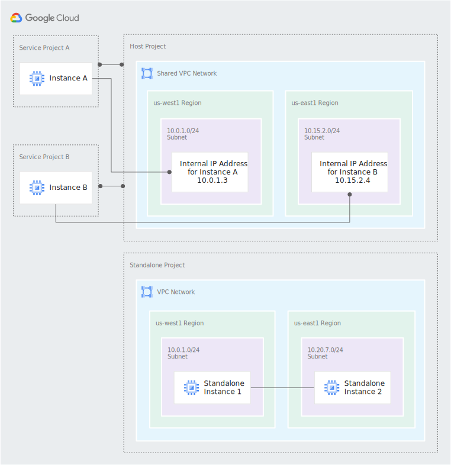
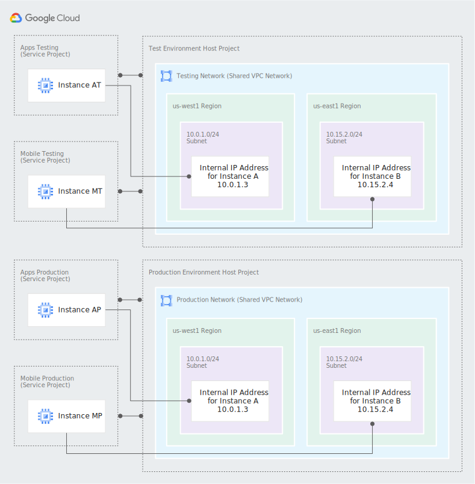

# Deploying Infrastrucutre in Google Cloud

## Motivation

While there are plenty of resources available to deploy IaC for AWS, for Google Cloud there is not that many, Google has made a great work creating a lot of modules, yet its not that easy to find reliable information on how to use all of them and the many options available.
With this particular repository, my aim was to provide with the code to bootstrap a full organization, this means that everything is focused with that in mind.
Based in the usage of Shared VPC, the concept of Shared VPC in Google Cloud its way different than the one from AWS, but it simplifies the management of multi level organization that requires all network resources in a central place without dealing with several projects just to manage the networking part, I will not cover the concepts here but feel free to read the documentation from Google Cloud that you can find [here](https://cloud.google.com/vpc/docs/shared-vpc)
This repository contains the needed IaC code to deploy a simple Shared VPC with most of the needed services the architecture looks similar to this:



But can easily be modified to something like this:



In fact you can modify the code an achieve any architecture that will fit your needs.

The IaC its done with Terraform and Terragrunt, also there is the posibility to use Atlantis(if you don't know it, you can find more information [here](https://www.runatlantis.io)) for PR automation.

### Pre-requisites

All the infrastructue is based in a monorepo, can be split into multiple repositories if required, but adjustments will need to be done to the code, with Terragrunt we can use dependencies to pass the outputs from each different module of the infrastructure, currently Terragrunt doesn't support dependencies from another repository hence the monorepo design(you can read about a workaround [here](https://github.com/gruntwork-io/terragrunt/issues/1952)).

Before you start, there are some pre-requisites you need to fullfil as per you are bootstrapping a new org, you probably have nothing but a default project created automatically by Google Cloud when you signed up, here are the steps needed to begin:

1. Add an Organization(if none already created yet), follow [this](https://cloud.google.com/resource-manager/docs/creating-managing-organization) instructions from Google
2. Make sure you have a user with the following Roles assigned at the organization level:
    - Billing Account Administrator
    - Compute Shared VPC Admin
    - Folder Creator
    - Organization Administrator
    - Project Creator
3. You need to install gcloud CLI, instructions can be found [here](https://cloud.google.com/sdk/docs/install)
4. Once installed make sure you run the following commands:
    - `gcloud auth login` follow the on screen instructions.
    - `gcloud auth application-default login` follow the on screen instructions.
5. Install Terraform and Terragrunt locally as per you will need for the initial bootstrap, I recommend using terraform v1.1.7 and terragrunt v0.36.3 as per those were the ones I used during the development of this solution.

### Deployment

To bootstrap the infrastrucutre you'll have to first comment in the backend portion of the root terragrunt.hcl [file](terragrunt.hcl)
```hcl
#remote_state {
#  backend = "gcs"
#  config = {
#    project  = "{HOST_PROJECT_ID}"
#    location = "eu"
#    bucket   = "${local.prefix}-tf-${local.environment}-state"
#    prefix   = "${path_relative_to_include()}/terraform.tfstate"
#
#    gcs_bucket_labels = {
#      owner = "Terraform Global"
#      name  = "terraform_state_storage"
#    }
#  }
#  generate = {
#    path      = "backend.tf"
#    if_exists = "overwrite_terragrunt"
#  }
#}
```
because we are going to use bucket in Cloud Storage as our backend and the idea is to provision all infra from scratch, we first will use a local backend.

So now move into the folder `regions/Global` there you need to edit the following files:
- ###### account.hcl
  Make sure you set those values accordingly.
  ```hcl
  locals {
    billing_id = "XXXXXX-XXXXXX-XXXXXX"
    org_id     = "organizations/11111111111"
  }
  ```
- ###### env.hcl
  This values are needed to provide the name of the project that is going to be created.
  ```hcl
  locals {
    environment = "host-project"
    prefix      = "xxx"
  }
  ```
- ###### region.hcl
  We dfine on which region we are going to create the resources and location is mostly used by Cloud Storage, but may be needed by other resources.
  ```hcl
  locals {
    region = "europe-west1"
    location = "eu"
  }
  ```
With this files modified to your needs then move into the folder `regions/Global/host-project` and mofidy the `terragrunt.hcl` file with your needed values, you can find information about the variables in the module [README](modules/bootstrap/README.md) file.
Here are some of the more important values you may want to change:
```hcl
inputs = {
  environments         = (["development", "staging", "production", "common"])
  iam_shared_owners    = ["user:user@domain.com"]
  iam_terraform_owners = ["user:user@domain.com"]
  force_destroy        = true
  global_user          = "terraform-global"

  network_name   = "global-network-demo"

  subnets = [
    {
      subnet_name               = "europe-west1-subnet-01"
      description               = "This subnet has a description"
      subnet_ip                 = "10.21.0.0/22"
      subnet_region             = "europe-west1"
      subnet_private_access     = "true"
      subnet_flow_logs          = "true"
      subnet_flow_logs_interval = "INTERVAL_10_MIN"
      subnet_flow_logs_sampling = 0.7
      subnet_flow_logs_metadata = "INCLUDE_ALL_METADATA"
    },
  ]

  secondary_ranges = {
    europe-west1-subnet-01 = [
      {
        range_name    = "europe-west1-subnet-01-secondary-pods"
        ip_cidr_range = "172.16.0.0/20"
      },
      {
        range_name    = "europe-west1-subnet-01-secondary-svc"
        ip_cidr_range = "192.168.0.0/22"
      },
    ]
  }
}
```
`environments` is a `list set` that will define the different environemnts your org have with this values folders and buckets will be created.
`iam_terraform_owners` This will define which user will be the owner of all the resources created by terraform.
`force_destroy` This variable allows to destroy GCS buckets if needed.
`global_user` This will be the user used by terraform to provision infrastructure using atlantis.
`network_name` This define the name of the network(VPC) to be created.
`subnets` This is list of string maps, that defines the different subnets to be created, and each subnet is contained within a single region. You can have more than one subnet in a region for a given VPC network. Each subnet has a contiguous private RFC1918 IP space.
`secondary_ranges` configurations for secondary IP ranges for VM instances contained in this subnetwork, in this case used for Pods and Services in GKE
More about subnets and secondary ranges can be found [here](https://cloud.google.com/vpc/docs/subnets)

Once the Global shared VPC has been deployed, just comment out the backend section:
```hcl
remote_state {
  backend = "gcs"
  config = {
    project  = "{HOST_PROJECT_ID}"
    location = "${local.location}"
    bucket   = "${local.prefix}-tf-${local.environment}-state"
    prefix   = "${path_relative_to_include()}/terraform.tfstate"

    gcs_bucket_labels = {
      owner = "Terraform Global"
      name  = "terraform_state_storage"
    }
  }
  generate = {
    path      = "backend.tf"
    if_exists = "overwrite_terragrunt"
  }
}
```
Make sure you replace `{HOST_PROJECT_ID}` with your actual host project id and then run the apply again into the host-project module, this will now transfer the state from the local backend to the Cloud Storage backend

Now with the Host Project deployed, the rest of the resources can be created, because this is designed as private VPC, there is no Internet access in and out, so a Cloud Router and Cloud Nat needs to be provisioned. we first deploy the Cloud Router, for that we go again into the folder `regions/Global/cloud-router` and we plan and apply.
Then move into `regions/Global/cloud-nat` and we plan and apply.

At this point we have deployed the minimum needed infrastructure needed to start deploying service projects and kubernetes, however we need some supporting resources to provide access to the infrastructure like VPN, optionally we can de ploy ArgoCD which will also take charge of deploying k8s applications and services, you can find it in this [repo](https://github.com), if you follow the next steps you will be able to deploy all of it.

##### Deploy Common Environment.
We move in the region where the environment is going to be deployed, in this example that will be EU and the west1 zone, but first we move into `regions/EU` and we modify the `account.hcl` same as we did before(refer to this [section](#accounthcl)) once you have change the `account.hcl` to suit your needs then move into the `west1` zone and also modify the `region.hcl`(refer to this [section](#regionhcl)) once modified to suit your needs then move into the environment folder `common` you need to modify the file `env.hcl`(refer to this [section](#envhcl))
At this point we are ready to deploy the service project, for that we move into the folder `service-project` here the only variable that need to be adjusted is `subnets_ids`, make sure it match your subnets, you can add as many as you need, but also make sure that the subnets has `secondary_ranges` defined, at least one for `Pods` and one for `Services` then plan and apply.

With the Service project created, we now can deploy the other resources.

1. `cloud-dns`, move into the `cloud-dns` folder, adjust the variables in terragrunt.hcl to match your needs, like below
   ```hcl
     type          = "private"
     name          = "domain-local-zone"
     domain        = "domain.local."
     force_destroy = true
   ```
    Run plan and apply.
2. `cloud-kms`, move into the folder `cloud-kms`, run plan and apply.
3. Deploy the `vpn-server`, move into the `vpn-server` folder and modify the variable `subnet` adding the self link to the subnet that the VPN will use, the VPN is based in [Pritunl](https://pritunl.com/), once the VPN is provisioned, you must access via https using the public IP provisioned for it `https://vpn_public_ip` and also connect via ssh(you can use this command `gcloud compute ssh vpn-server --project {common_project_id}` make sure you use your actual project id) and run the commands that are presented to you in the web console of Pritunl, I will not cover how to configure Pritunl, their documentation is very straigh forward and easy to follow.
4. Deploy kubernetes, for that we move into `gke` folder, you need to modify some variables in `terragrunt.hcl` to adjust to your current setup, will list the are more likely to require changes:
   ```hcl
     cluster_name            = "common-cluster-1"
     regional                = true
     subnetwork              = "europe-west1-subnet-01"
     ip_range_pods           = "europe-west1-subnet-01-secondary-pods"
     ip_range_services       = "europe-west1-subnet-01-secondary-svc"
     enable_private_endpoint = true
     enable_private_nodes    = true
     master_ipv4_cidr_block  = "10.0.0.0/28"
     master_authorized_networks = [
       {
         cidr_block   = "10.20.0.0/14"
         display_name = "All Subnets"
       },
     ]
   ```
    `cluster_name`: this is the name of your k8s cluster to be created
    `subnetwork`: The subnet that will be used by GKE
    `ip_range_pods`: The secondary range that will be used to assign IPs for the pods.
    `ip_range_services`: The secondary range that will be used to assign IPs to the k8s service resource type.
    `enable_private_endpoint`: Makes the GKE cluster private(not accessible thru public IP)
    `enable_private_nodes`: Worker Nodes will be private, no public IP assigned to them.
    `master_ipv4_cidr_block`: The master nodes are hosted by Google but we need to provide their IP subnet
    `master_authorized_networks`: The subnets that we will allow the masters to be reachable from.
    Once done with the modifications, plan and apply, be aware this process can take up 15 minutes, depending on the amount of node groups to be provisioned.
5. The next step is to enable `Workload Identity` integration, if you are not familiar with `Workload Identity` follow this [link](https://cloud.google.com/kubernetes-engine/docs/concepts/workload-identity), this are required by the deployment with ArgoCD, leave them as they are and the integration will work out of the box, if you want to modify them, makre sure you adjust your k8s workloads. move into `workload-identity` and then inside of each of the sub folders `sops-secrets-operator`, `external-dns` and `atlantis` and run plan and apply on each of them.

Now after this point, you can deploy ArgoCD, follow the instructions in this [repository](https://github.com/runderwoodcr14/argocd-infrastructure.git)

#### Atlantis
If you deployed ArgoCD as mentioned above, now you have the ability to continue the deployment of your infrastructure using Atlantis you can modify the atlantis configuration by editing the file [atlantis.yaml](atlantis.yaml)


## Troubleshooting

If you face some problems by running locally `terragrunt plan` or `terragrunt apply` you may consider running it like this:
`terragrunt plan --terragrunt-non-interactive --terragrunt-include-external-dependencies --terragrunt-download-dir ~/tfcode`
`terragrunt apply --terragrunt-non-interactive --terragrunt-include-external-dependencies --terragrunt-download-dir ~/tfcode`

This is related with the download of the modules via ssh and there is an issue open about it, which you can check [here](https://github.com/gruntwork-io/terragrunt/issues/1331)

